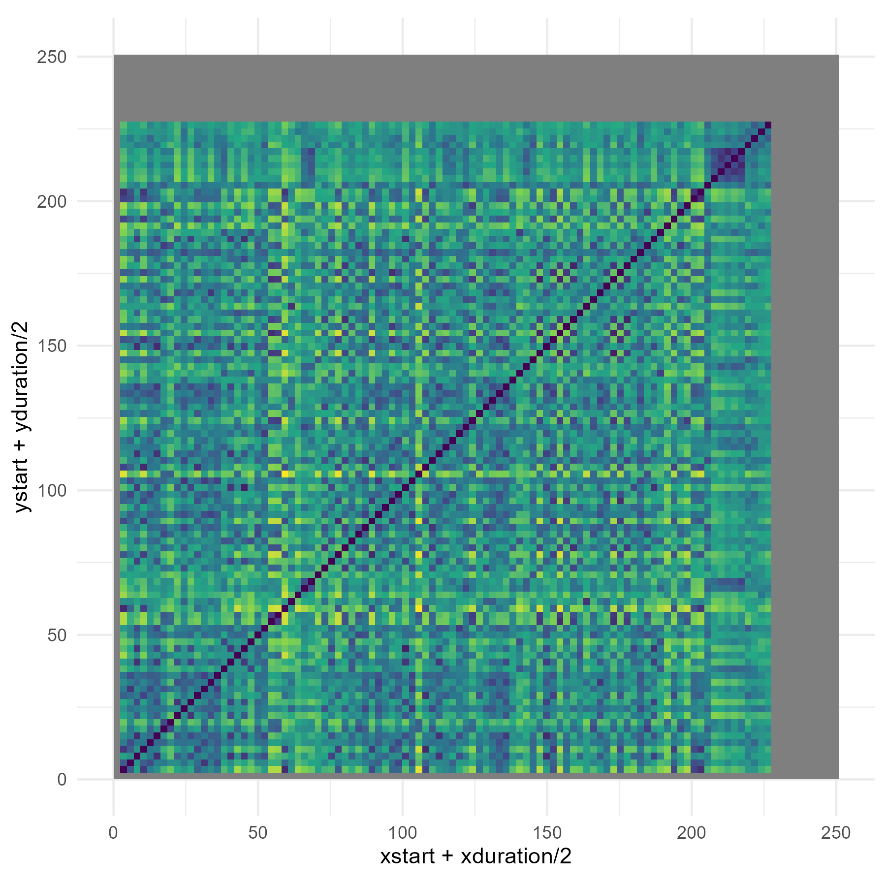
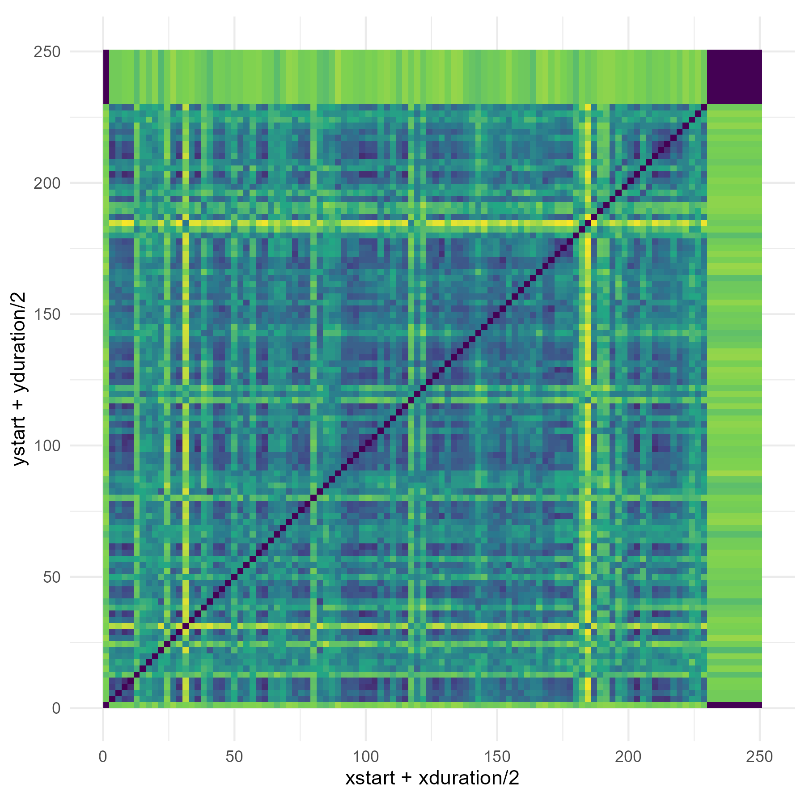

# Song Analysis

## Chromagram (Pitch-Based Self-Similarity)
Comparing the pitch-based self-similarity matrix, distinct block patterns correspond to the musical sections of the song: A1, A2, B, A1, B, A2, where A represents verses and B the chorus. Around 60 seconds, the first chorus begins, with higher pitch reflected as a yellow/green vertical line in the matrix. A similar pattern appears just before 150 seconds during the second chorus, marked by richer harmonies in the line “cause I, cause I, I don't know how to feel.” Towards the end, the instrumentation is sparser and primarily vocals, producing thicker green bands that reflect the overall pitch stability.

## Timbre (Timbre-Based Self-Similarity)
Examining the timbre-based self-similarity matrix, several connections between sound and visual representation are visible. Around 30–40 seconds, a yellow line corresponds to a peak in the song where additional instruments are heard during the lyrics “taking a drive.” Green lines around 80 seconds reflect sections with mostly humming vocals. Around 120 seconds, new instruments appear, indicated by corresponding lines in the matrix. Thick yellow lines near 180 seconds represent a unique instrument with a “twinkling” or shimmering quality, heard only in that section.

### Plots

